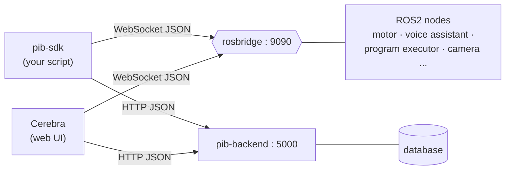

# pib-sdk

A Python SDK for [pib](https://pib.rocks) humanoid robot: kinematics, motor
control, speech, live telemetry, and everything a user can create in
**Cerebra** (pib's web UI) — poses, Blockly programs, RGB-button bindings,
the voice assistant, and more.

Positions are in **millimetres**, joint angles in **degrees**, and orientations
as **roll–pitch–yaw** (see [Conventions](#conventions)).

**Full API reference:** [docs/REFERENCE.md](docs/REFERENCE.md) covers every
module below in detail, including caveats worth knowing before you rely on
them (e.g. what "position" telemetry actually means, what RGB buttons can
and can't do). This README is a quick-start for the core four; everything
else is one import away.

---

## Architecture at a glance

pib-sdk is one of **two independent clients** of the same robot-side
services — the other is Cerebra. Neither wraps the other: both call the same
rosbridge services/topics and the same pib-backend REST routes, so nothing
this SDK does (including the voice assistant and Blockly programs) is a
reimplementation of logic that already lives on the robot.



Full control-flow diagrams — the voice assistant call sequence, the Blockly
program proxy, the kinematics/Pinocchio layering, telemetry pull-vs-push —
live in **[docs/ARCHITECTURE.md](docs/ARCHITECTURE.md)**.

---

## Requirements

* **Python 3.9+** (3.11+ works out of the box on current Raspberry Pi OS).
* **[Pinocchio](https://github.com/stack-of-tasks/pinocchio)** (`pin`) `>= 3.1`
  — the kinematics backend, installed automatically from PyPI wheels.
* **numpy** `>= 1.22`.
* **roslibpy** `>= 1.6` — rosbridge client (only needed for things that talk
  to hardware; pure kinematics needs no connection).
* A running **rosbridge** server on the robot (WebSocket, default port
  `9090`) for motor control, speech, telemetry, and live program/voice-
  assistant control.
* **pib-backend**'s REST API (default port `5000`, same host, no
  authentication) for anything sourced from Cerebra: poses, programs,
  button bindings, camera/motor settings, personalities, chats.

There are **no system packages to install** and **no version-pinned scientific
dependencies**. Pinocchio ships prebuilt wheels (including `aarch64` for the
Raspberry Pi), so a plain `pip install` works — no `apt`, no `conda`, no
building from source.

---

## Installation

From PyPI:

```bash
pip install pib-sdk
```

---

## Quick start

### Kinematics

```python
from pib_sdk import fk, ik

# Inverse kinematics: target position in millimetres -> joint angles in degrees
q_deg = ik("right", xyz=[-400, 100, 900])
print("IK angles:", q_deg)

# Forward kinematics: joint angles in degrees -> end-effector pose
pose = fk("right", [0, 45, 0, 0, 90, 0])
print("palm position (mm):", pose.translation)
print("palm orientation (3x3):\n", pose.rotation)
```

`fk` returns a [`pinocchio.SE3`](https://github.com/stack-of-tasks/pinocchio);
read `pose.translation` (mm) and `pose.rotation`, or convert:

```python
from pib_sdk import pose_to_xyz_rpy
xyz_mm, rpy_deg = pose_to_xyz_rpy(pose)
```

> **Need raw Pinocchio?** You already have it — `fk`/`ik` consume and return
> real `pinocchio.SE3` objects, not a pib-sdk wrapper type. For the
> underlying model, `pib_sdk.robot_model.get_arm_model("right").model` is the
> actual `pin.Model` (and `.create_data()` a fresh `pin.Data`) that `ik`
> solves against — useful for calling Pinocchio functions directly (custom
> Jacobians, etc.) against that same model. `pinocchio` itself is a required
> dependency (`pin>=3.1`), so `import pinocchio as pin` always works
> standalone; pib-sdk just never re-exports the module as `pib_sdk.pin`.
> Details:
> [docs/ARCHITECTURE.md](docs/ARCHITECTURE.md#deep-dive-kinematics-pinocchio-and-the-escape-hatch).

### Driving the arm with an IK solution

The IK joint order matches the `right_arm` / `left_arm` motor groups exactly, so
the result feeds straight into `Write.move`:

```python
from pib_sdk import Write, ik, right_arm

q_deg = ik("right", xyz=[-400, 100, 900])

with Write(host="pib.local") as w:   # rosbridge on the robot (localhost by default)
    w.move(right_arm, *q_deg)        # one angle per joint, in order
```

### Motor control

```python
from pib_sdk import Write, All, default, right_arm, left_hand, zero_position, open_right_hand

w = Write(host="localhost")            # connects to rosbridge

w.set(All, default)                    # apply the default MotorSettings to all motors
w.set(left_hand, velocity=6000)        # override settings for one group

w.move(right_arm, -30.0)               # uniform: one angle applied to the whole group
w.move(right_arm, 10, -20, 5, 30, -10, 0)   # vector: one angle per joint
w.move(All, zero_position)             # everything to 0°
w.move(open_right_hand)                # hand shortcut
```

### Speech

```python
from pib_sdk import Speak

with Speak(host="localhost") as sp:
    sp.say("hello world")                # default voice: Emma (Female, English)
    sp.say("guten Tag", voice="Hannah")  # preset -> Female / German
```

### Head camera pose (kinematics)

```python
from pib_sdk import camera_pose

pose = camera_pose(pan_deg=30, tilt_deg=-10)     # camera pose in the base frame (mm)
```

This is forward kinematics for the head/camera frame — not to be confused
with `pib_sdk.features.camera`, which fetches an actual JPEG snapshot; see
[docs/REFERENCE.md](docs/REFERENCE.md#pib_sdkfeaturescamera).

### Everything else: one connection, one import

`Robot` bundles motor control, speech, telemetry, and pib-backend's REST API
behind a single host, so you don't reconnect four times:

```python
from pib_sdk import right_arm
from pib_sdk.robot import Robot

with Robot(host="pib.local") as robot:
    robot.write.move(right_arm, -30.0)
    robot.speak.say("moving my arm")
    print(robot.telemetry.get_position_deg("shoulder_vertical_right"))
    print(robot.backend.list_poses())
```

| Want to... | Use | 
|---|---|
| Read a motor's last commanded position / live current draw | `pib_sdk.telemetry.Telemetry` |
| Talk to pib-backend's REST API directly (poses, programs, motors, camera, voice assistant...) | `pib_sdk.backend.BackendClient` |
| Turn an image into an arm-drawn trajectory | `pib_sdk.features.drawing` |
| Drive to / save poses created in Cerebra | `pib_sdk.features.poses` |
| Run or stop a Blockly program saved in Cerebra | `pib_sdk.features.programs` |
| See/change which program an RGB button triggers | `pib_sdk.features.buttons` |
| Grab a camera snapshot | `pib_sdk.features.camera` |
| Drive the voice assistant: state, chats, personalities | `pib_sdk.features.assistant` |
| Push an image to pib's screen | `pib_sdk.features.display` |
| Read/set the solid-state relay | `pib_sdk.features.relay` |

> `features.assistant` and `features.programs` call the exact same rosbridge
> services and REST routes Cerebra itself uses for chat and "run program" —
> see [Two equal clients](docs/ARCHITECTURE.md#two-equal-clients-not-a-client-and-a-fallback).

Details, caveats, and full examples for each: **[docs/REFERENCE.md](docs/REFERENCE.md)**.

---

## Joint ↔ motor names

The URDF and the motor firmware use slightly different names for a few joints.
The SDK keeps both: kinematics is expressed in URDF joint order, and each chain
also carries the matching **motor** name so IK output lines up with
`Write.move`. You normally never need this table — it's here for reference.

| Chain | URDF joint | pib motor | Limits (°) |
|-------|------------|-----------|------------|
| right_arm | `shoulder_vertical_right` | `shoulder_vertical_right` | −90 … 90 |
| right_arm | `shoulder_horizontal_right` | `shoulder_horizontal_right` | −90 … 90 |
| right_arm | `upper_arm_right` | `upper_arm_right_rotation` | −90 … 90 |
| right_arm | `elbow_right` | `elbow_right` | −45 … 90 |
| right_arm | `forearm_right` | `lower_arm_right_rotation` | −90 … 90 |
| right_arm | `wrist_right` | `wrist_right` | −30 … 30 |
| head | `head_horizontal` | `turn_head_motor` | −90 … 90 |
| head | `head_vertical` | `tilt_forward_motor` | −45 … 70 |

The left arm mirrors the right. Inspect any chain yourself:

```bash
python -m pib_sdk.robot_model
```

> **Hardware sign check.** The URDF's zero pose has both arms pointing straight
> out to the sides, matching pib's motor zero. Joint directions in the URDF
> follow the URDF's axis conventions; if a real motor turns opposite to the
> model on your unit, flip it with the motor's `invert` setting
> (`w.set("<motor>", invert=True)`) rather than negating angles in your code.
> Verify one joint at a time on first bring-up.

---

## Conventions

* **Positions**: millimetres.
* **Joint angles**: degrees. Order is base → tip, as printed by
  `python -m pib_sdk.robot_model`.
* **Orientation**: roll–pitch–yaw in degrees, applied as
  `R = Rz(yaw) · Ry(pitch) · Rx(roll)` (ZYX — the same convention the previous
  Robotics Toolbox implementation used).
* **Poses**: [`pinocchio.SE3`](https://github.com/stack-of-tasks/pinocchio),
  expressed in pib's base frame.

### Inverse kinematics options

`ik(side, xyz=..., ...)` (and `ArmKinematics.inverse`) accept:

| Option | Default | Meaning |
|--------|---------|---------|
| `rpy_deg` | `None` | Target orientation. `None` → position-only IK. |
| `initial_guess_deg` | zeros | Starting joint configuration (degrees). |
| `tolerance` | `1e-4` | Convergence threshold on the pose error (mm-scaled). |
| `max_iterations` | `200` | Solver iterations per attempt. |
| `mask` | auto | 6-element `[x, y, z, rx, ry, rz]` selector over the pose error. |
| `restarts` | `50` | Random in-limit restarts if the first solve misses. |
| `respect_limits` | `True` | Keep the solution within mechanical joint limits. |

With `respect_limits=True` (the default) any returned solution is guaranteed to
be within joint limits and therefore safe to send to `Write.move`. IK raises
`ValueError` if it cannot reach the target.

---

## Using a different or updated URDF

The package ships pib's V3 URDF at `pib_sdk/data/pib_model.urdf`. To use another
file — a newer revision, or a variant of your robot — point the loader at it:

```python
from pib_sdk import set_urdf_path
set_urdf_path("/path/to/robot.urdf")
```

or set the `PIB_URDF_PATH` environment variable before importing. The joint and
frame names in `pib_sdk.robot_model` (`RIGHT_ARM`, `LEFT_ARM`, `HEAD`) must
match those in your URDF; mismatches raise a clear error listing the names the
URDF actually provides.

> **Meshes are not required.** Kinematics uses only the URDF's joint tree, so
> the visual/collision `.stl` meshes referenced by the URDF are not needed and
> are not bundled. Pinocchio loads the kinematic model without them.

---

## Development

```bash
pip install -e ".[dev]"

pytest          # run the test suite
ruff check src tests
ruff format src tests
python -m build # build the sdist and wheel
```

The tests include an independent forward-kinematics implementation (URDF parsed
with `xml.etree`, transforms multiplied with plain numpy) that cross-checks the
Pinocchio models to machine precision — a guard against URDF-loading or
unit-scaling regressions. Everything that talks to rosbridge or pib-backend is
tested offline against fakes (see `tests/conftest.py`) — no real robot or
server needed to run the suite.

---

## License

MIT — see [LICENSE](LICENSE).
