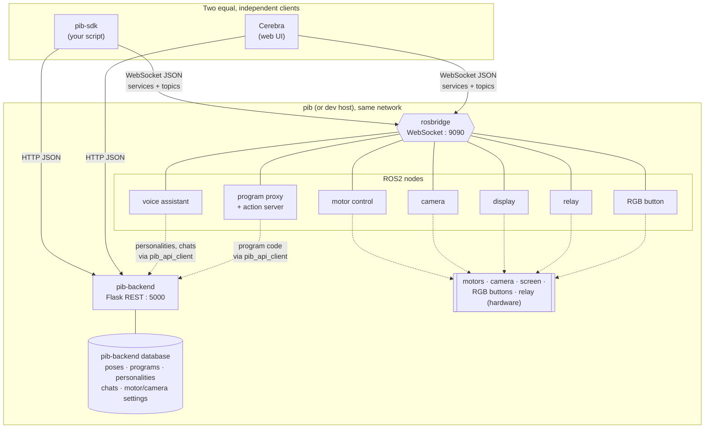
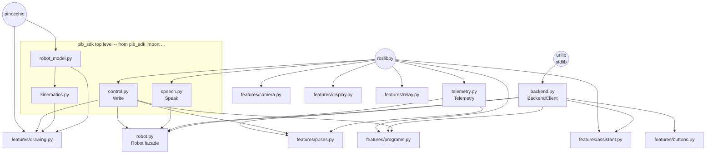
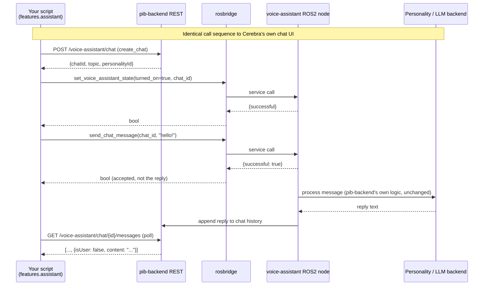
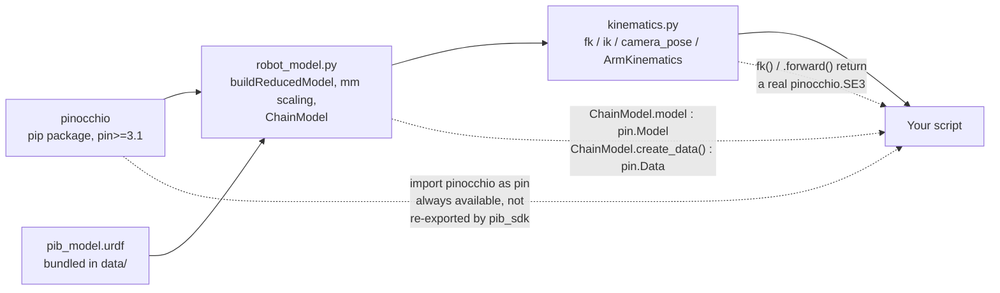
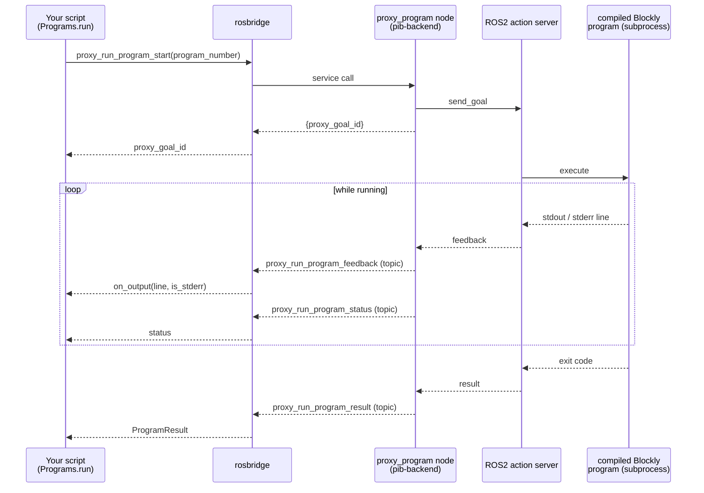
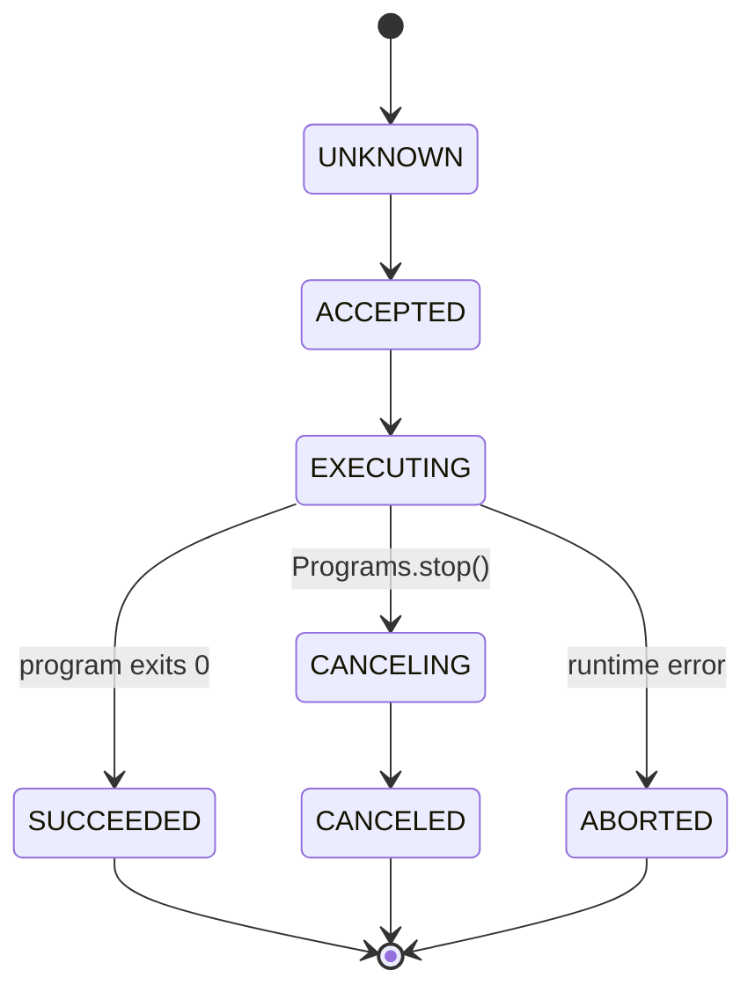
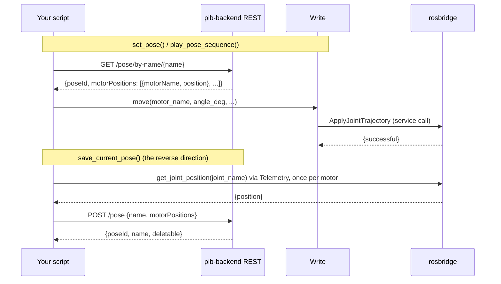
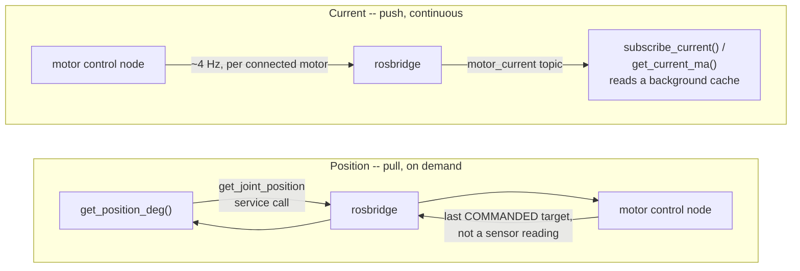

# pib-sdk architecture

This document is the "how it fits together" companion to
**[docs/REFERENCE.md](REFERENCE.md)** (the per-module API reference) and the
**[README](../README.md)** (quick-start). Everything below was drawn directly
from this SDK's source and pib-backend's source — service names, topic
names, and message types are copy-checked against `src/pib_sdk`, not
approximated.

## Contents

- [Big picture](#big-picture)
- [Two equal clients, not a client and a fallback](#two-equal-clients-not-a-client-and-a-fallback)
- [The three communication patterns](#the-three-communication-patterns)
- [Module dependency graph](#module-dependency-graph)
- [Deep dive: the voice assistant is not reimplemented here](#deep-dive-the-voice-assistant-is-not-reimplemented-here)
- [Deep dive: kinematics, Pinocchio, and the escape hatch](#deep-dive-kinematics-pinocchio-and-the-escape-hatch)
- [Deep dive: running a Blockly program](#deep-dive-running-a-blockly-program)
- [Deep dive: poses — apply vs. save](#deep-dive-poses--apply-vs-save)
- [Deep dive: telemetry — pull vs. push](#deep-dive-telemetry--pull-vs-push)

---

## Big picture

pib-sdk and Cerebra are **two independent clients of the same robot-side
services** — neither wraps the other, and there is no logic duplicated
between them. Both speak to the same rosbridge WebSocket and the same
pib-backend REST API; both ultimately drive the same ROS2 nodes.

Two hosts/ports show up everywhere in this SDK because there are genuinely
two servers on the robot:

| Server | Port | Protocol | Owns |
|---|---|---|---|
| rosbridge | 9090 | WebSocket (JSON) | real-time: motor commands, telemetry, live assistant/program control |
| pib-backend | 5000 | HTTP (REST/JSON) | durable data: poses, programs, button bindings, settings, personalities, chats |

`pib_sdk.robot.Robot` exists purely to hold one connection to each so a
script doesn't reconnect four times — see the README.

---

## Two equal clients, not a client and a fallback

This is the direct answer to "is pib-sdk's voice assistant separate from
Cerebra's?": **no.** Nothing in this SDK reimplements dialogue handling,
program execution, or pose storage. Every feature module is a thin client
over a service, topic, or REST route that already exists in pib-backend for
Cerebra's own use:

| This SDK's module | Talks to | Which Cerebra also talks to |
|---|---|---|
| `features.assistant.Assistant` | `get_voice_assistant_state`, `set_voice_assistant_state`, `get_chat_is_listening`, `send_chat_message` (rosbridge services) | same services, from Cerebra's chat UI |
| `features.assistant` (REST half) | `/voice-assistant/personality`, `/voice-assistant/chat` (+`/messages`) | same routes, from Cerebra's personality/chat screens |
| `features.programs.Programs` | `proxy_run_program_start/stop` + `proxy_run_program_feedback/result/status` | same proxy, from Cerebra's "run program" button |
| `features.poses` | `/pose`, `/pose/by-name/...`, `/pose/.../motor-positions` | same routes, from Cerebra's pose editor |
| `features.buttons` | `/button-programs` | same route, from Cerebra's button-binding screen |

If pib-backend's assistant logic changes (a new personality field, a
different LLM backend, etc.), this SDK doesn't need to change to match it —
it never encoded that logic to begin with. See the
[voice assistant deep dive](#deep-dive-the-voice-assistant-is-not-reimplemented-here)
for the exact call sequence.

---

## The three communication patterns

Every class in this SDK that talks to the robot uses one of exactly three
shapes. Once these three click, every module's source is predictable.

```mermaid
flowchart TD
    subgraph P1["1. REST -- request / response"]
        direction LR
        A1["BackendClient"] -->|"HTTP GET/POST/PUT/PATCH/DELETE"| A2["pib-backend : 5000"]
        A2 -->|"JSON body"| A1
    end

    subgraph P2["2. ROS2 service call -- request / response"]
        direction LR
        B1["Write · Telemetry · Programs\nAssistant · Camera · Relay"] -->|"service.call(request, timeout=...)"| B2["rosbridge : 9090"]
        B2 --> B3["ROS2 node"]
        B3 -->|response| B2 -->|response| B1
    end

    subgraph P3a["3a. ROS2 topic -- publish, fire-and-forget"]
        direction LR
        C1["Display"] -->|"topic.publish(Message)"| C2["rosbridge : 9090"]
        C2 --> C3["display node"]
    end

    subgraph P3b["3b. ROS2 topic -- subscribe, streaming"]
        direction LR
        D3["ROS2 node"] -->|message| D2["rosbridge : 9090"]
        D2 -->|"callback(message)\non every message"| D1["Telemetry · Programs\nRelay · Write (echo)"]
    end
```

| # | Pattern | Code shape | Used by |
|---|---|---|---|
| 1 | REST | `self._request("GET", "/pose")` → immediate JSON | `BackendClient` (poses, programs, buttons, motors, camera settings, personalities, chats) |
| 2 | ROS2 service call | `service.call(roslibpy.ServiceRequest({...}), timeout=...)` → blocks for one response | `Write.set`/`Write.move` (`/apply_motor_settings`, `/apply_joint_trajectory`), `Telemetry.get_position_deg` (`get_joint_position`), `Programs.start`/`stop` (`proxy_run_program_start/stop`), `Assistant.*` (all four assistant services), `Camera.get_snapshot_bytes` (`get_camera_image`), `Relay.set` (`set_solid_state_relay_state`) |
| 3a | ROS2 topic, publish | `topic.publish(roslibpy.Message({...}))` → no response | `Display.show_*`/`clear` (`display_image`) — the **only** fire-and-forget publish in this SDK |
| 3b | ROS2 topic, subscribe | `topic.subscribe(callback)` → callback fires per message, forever until unsubscribed | `Telemetry.subscribe_current`/`get_current_ma` (`motor_current`), `Programs.run` (`proxy_run_program_feedback/result/status`), `Relay.get_state`/`subscribe` (`solid_state_relay_state`), `Write`'s opt-in `verify_echo` (`/joint_trajectory`, `/motor_settings`) |

Note that `Write.move()` is a **service call**, not a topic publish — it's
easy to assume otherwise since "move" sounds like a fire-and-forget command.
`Write` only *subscribes* to `/joint_trajectory` and `/motor_settings`, and
only to opportunistically confirm a command echoed back when
`verify_echo=True`.

---

## Module dependency graph

The `TOP` box is exactly (and only) what `pib_sdk/__init__.py` re-exports:
`control`, `kinematics`, `robot_model`, and `speech`. **`backend`,
`telemetry`, `robot`, and everything under `features/` need their own
explicit import** (`from pib_sdk.telemetry import Telemetry`, `from
pib_sdk.features.poses import set_pose`, etc.) — `import pib_sdk` alone does
not pull them in. This is deliberate: the top-level namespace is the part of
the SDK that needs no live connection (pure kinematics), and everything
that talks to a robot is opt-in.

The same rule applies to Pinocchio itself: `pib_sdk` never re-exports the
`pinocchio` module under its own name, at any level. See the next section.

---

## Deep dive: the voice assistant is not reimplemented here

`features/assistant.py` has no dialogue, NLU, or LLM logic — every call is a
direct pass-through to a service or REST route pib-backend already runs for
Cerebra. Sending a message from this SDK is indistinguishable, from
pib-backend's point of view, from typing it into Cerebra's chat window.

The last step is why `Assistant.send_message` returns a plain `bool`
("accepted"), not the reply text — pib-backend answers asynchronously (it
may also run a program or speak out loud) and only ever appends the answer
to the chat's message history. Polling `list_chat_messages` is the same
thing Cerebra's UI does to display the response.

---

## Deep dive: kinematics, Pinocchio, and the escape hatch

Pinocchio is a real, required dependency (`pin>=3.1`) — not vendored,
wrapped, or hidden. `pib_sdk` builds its kinematics API on top of it but
never blocks access to the underlying objects.

Three ways to reach raw Pinocchio, in increasing order of how much of the
SDK you're bypassing:

1. **You already have it.** `fk("right", q_deg)` and
   `ArmKinematics.forward(...)` return an actual `pinocchio.SE3` — not a
   pib-sdk wrapper type. `pose.translation` / `pose.rotation` are Pinocchio's
   own attributes.
2. **Drop to the model.** `get_arm_model("right").model` is the real
   `pin.Model` pib-sdk solves against (already URDF-loaded, reduced to the
   arm's 6 joints, and scaled to millimetres); `.create_data()` hands you a
   fresh `pin.Data` buffer. Useful for calling `pin.computeFrameJacobian`,
   `pin.forwardKinematics`, etc. yourself, on the exact same model the
   built-in solver uses.
3. **Bypass pib-sdk's kinematics entirely.** `pinocchio` is guaranteed
   installed alongside pib-sdk (it's a hard dependency, not an extra), so
   `import pinocchio as pin` always works with no separate install step —
   `pib_sdk` simply never puts that import under its own name (there's no
   `pib_sdk.pin`).

---

## Deep dive: running a Blockly program

Programs are authored and stored in Cerebra, then executed on the robot as
a standalone compiled script run through a ROS2 **action**. rosbridge
couldn't speak ROS2 actions when pib-backend was built, so pib-backend
exposes a service/topic "proxy" in front of that action — ordinary
rosbridge traffic, which is what `features.programs.Programs` talks to.

`status` is a standard ROS2 `action_msgs/msg/GoalStatus` value, published
verbatim:

| Value | Name | Terminal? |
|---|---|---|
| 0 | `STATUS_UNKNOWN` | no |
| 1 | `STATUS_ACCEPTED` | no |
| 2 | `STATUS_EXECUTING` | no |
| 3 | `STATUS_CANCELING` | no |
| 4 | `STATUS_SUCCEEDED` | **yes** |
| 5 | `STATUS_CANCELED` | **yes** |
| 6 | `STATUS_ABORTED` | **yes** |

`Programs.run()` stops waiting as soon as the result topic fires (it
doesn't need to see a terminal status separately); `stop_all()` /
`emergency_stop()` only act on goals started through that same `Programs`
instance — there's no "list every running program" call on the backend, so
a program started from Cerebra itself is invisible to `stop_all()`.
`emergency_stop()` still turns off all motors regardless, which halts
movement no matter what commanded it.

---

## Deep dive: poses — apply vs. save

There's no native "move to pose" or "save this pose" call on the robot;
Cerebra assembles both from lower-level primitives, and so does this SDK.

`play_pose_sequence` is just this loop repeated with a `time.sleep` between
poses — Cerebra itself only offers pose sequencing via chained "move to
pose" + "wait" Blockly blocks, so there's no richer primitive to call
underneath.

---

## Deep dive: telemetry — pull vs. push

`Telemetry`'s two values come from pib-backend in fundamentally different
ways, which is why one method call blocks briefly and the other reads from
a background cache:

`get_position_deg` answers "what did I last **tell** this motor to do" —
pib-backend's true encoder-backed position read exists internally
(`Motor.get_current_position()`) but is never published over rosbridge or
REST, so it can't detect a stall or a hand-moved joint. `get_current_ma` is
genuine live telemetry (electrical current, in milliamps); a motor with no
current bricklet wired up simply never appears on the topic, which is
steady state, not a bug.

---

*Diagrams are [Mermaid](https://mermaid.js.org/); GitHub, most IDE markdown
previews (including VS Code's), and mermaid.live render them without any
extra tooling.*
